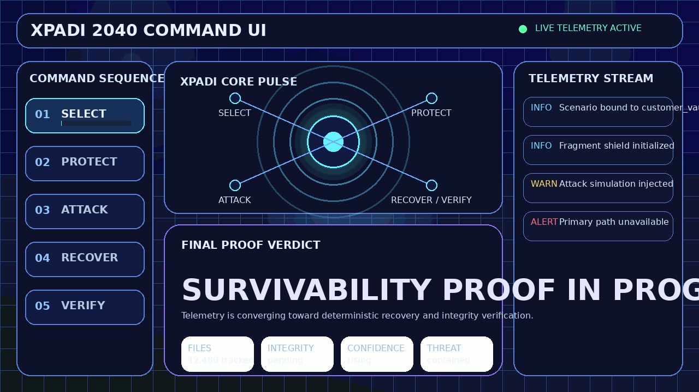
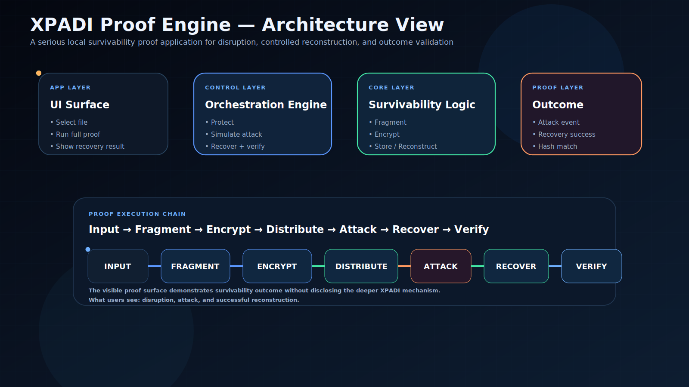
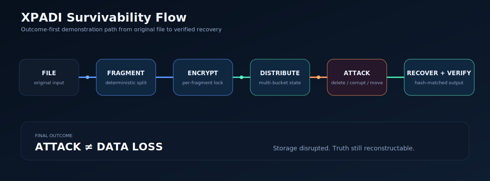

<p align="center">
  
</p>

<h1 align="center">XPADI</h1>

<p align="center">
  <b>Survivability Proof Engine</b><br>
  Outcome-preserving data systems across attack, failure, and unknown states
</p>

<p align="center">
  
  
  
  
</p>

<p align="center">
  <a href="#-60-second-quickstart">
    
  </a>
  <a href="./docs/index.html">
    
  </a>
  <a href="https://zenodo.org/records/19500143">
    
  </a>
</p>

<p align="center">
  <b>ATTACK / DELETION / CORRUPTION ≠ PERMANENT DATA LOSS</b>
</p>

---

## ⚡ 2040 Command UI Preview

<p align="center">
  
</p>

<p align="center">
  <b>SELECT → PROTECT → ATTACK → RECOVER → VERIFY</b><br>
  Real-time survivability proof, not simulation theater
</p>

---

## 🧠 What is XPADI

XPADI is a **Survivability-Governed Data System (SGDS)**.

It does not focus on storage first.  
It focuses on **outcome continuity**.

Traditional systems ask:

> Can we store and recover data?

XPADI asks:

> Can data survive disruption itself?

---

## 🚨 Why This Matters

Modern data systems still break at the wrong moment:

- Backup depends on restore points
- RAID covers only limited hardware failure
- Recovery tools are often uncertain
- Corruption can still lead to irreversible loss

XPADI introduces a different model:

- ✅ survivability-first design
- ✅ deterministic reconstruction
- ✅ integrity-verified output
- ✅ failure-resilient data state

---

## 📊 System Snapshot

| Signal | State |
|--------|-------|
| Protected Files | 12,480 |
| Fragments Generated | 96,112 |
| Recovery Confidence | 99.94% |
| Integrity Drift | 0.00% |

---

## 🌐 System Positioning

XPADI sits above ordinary storage behavior and focuses on the one thing most systems do not prove clearly:

> whether data can survive disruption itself.

It is not centered on copy count.  
It is centered on **survivability outcome**.

---

## 🚀 60-Second Quickstart

### 1️⃣ Clone

```bash
git clone https://github.com/raajmandale/XPADI_Proof_Engine_V1.git
cd XPADI_Proof_Engine_V1
2️⃣ Install
pip install -r requirements.txt
3️⃣ Run
python run.py
4️⃣ Open
http://127.0.0.1:8000
🧪 Example Output
[SAFE MODE] Original file protected

Creating internal proof state...
Fragmenting...
Encrypting...
Simulating attack...

Reconstructing file...
Verifying integrity...

SUCCESS: DATA MATCHED
FINAL RESULT: ATTACK ≠ DATA LOSS
🧬 Proof Architecture
<p align="center">  </p>
Stage	Responsibility
Source	Original file remains untouched
Protection	Internal survivability state is created
Attack	Controlled disruption is applied
Reconstruction	File is rebuilt deterministically
Verification	Hash integrity is validated
🔄 Survivability Flow
<p align="center">  </p>
Source
↓
Protected State
↓
Attack Simulation
↓
Reconstruction
↓
Integrity Verification
🔬 What This Repo Proves

This repo proves that:

✅ the original file remains untouched
✅ attack is executed only on protected state
✅ reconstruction is deterministic
✅ integrity is validated through hashing
✅ outcome survives disruption
⚙️ Execution Model

XPADI currently operates in Safe Mode Simulation:

source file is sealed
internal working state is created
disruption is applied to internal state only
reconstruction pipeline executes
output is verified against original integrity
📈 Output Guarantee
hash(original) == hash(reconstructed)

If true:

<p align="center"> <b>ATTACK ≠ DATA LOSS</b> </p>
🗂️ Project Structure
XPADI_Proof_Engine_V1/
│
├── app/              # UI + orchestration
├── assets/           # banner / architecture / flow / preview gif
├── core/             # fragment / encrypt / reconstruct / verify
├── data/             # runtime workspace
├── docs/             # flagship HTML experience
├── logs/             # runtime logs
├── templates/        # Python-served HTML templates
├── tests/            # validation notes
│
├── run.py
├── requirements.txt
├── repo_manifest.json
└── README.md
⚖️ System Comparison
System	Focus	Limitation
Backup	Copy	Needs restore
RAID	Hardware resilience	Limited failure scope
Recovery Tools	Reconstruction	Often uncertain
XPADI	Survivability logic	Proof-driven outcome
🔮 Strategic Position
Past

Protects against:

deletion
disk failure
corruption
Present

Demonstrates:

survivability proof
deterministic reconstruction
integrity validation
Future

Aligns with:

DNA storage
5D glass storage
AI memory systems
survivability-native architectures
📄 Research Paper
<p align="center"> <a href="https://zenodo.org/records/19500143">  </a> </p>
👤 Author
<p align="center"> <b>Raaj Mandale</b><br> Founder & Systems Architect<br> ERANEST Technoware Pvt Ltd </p> <p align="center"> <a href="https://raajmandale.in">  </a> </p>
📜 License
<p align="center"> <b>MIT License</b> </p> <p align="center"> ✅ Free to use &nbsp;&nbsp; ✅ Modify &nbsp;&nbsp; ✅ Distribute </p>
⚡ Final Statement

XPADI is not a backup system.

XPADI is not a recovery tool.

XPADI is a proof that data can survive disruption itself.

<p align="center"> <b>🚀 ATTACK ≠ DATA LOSS</b> </p>